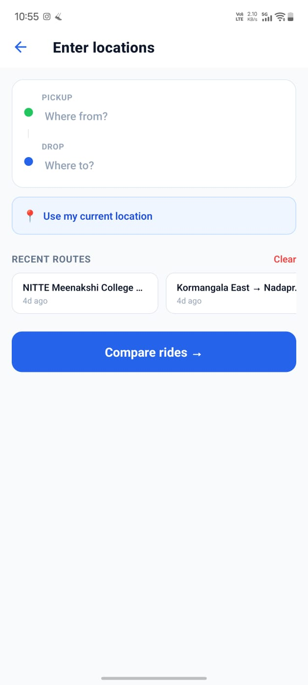
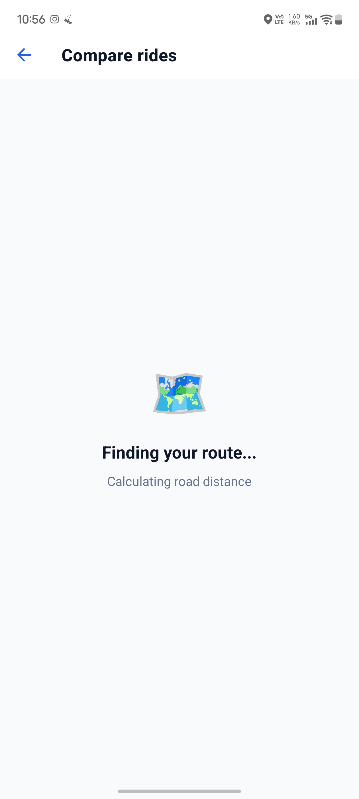
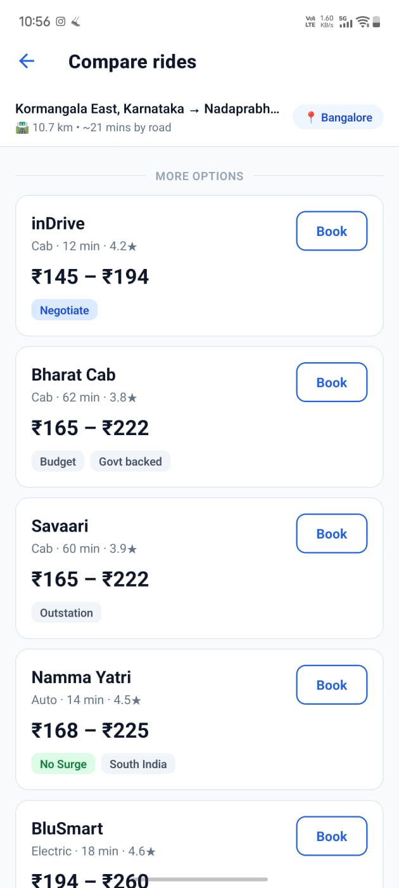

# FareSnap 🚗

Compare ride fares across 9 apps instantly — Uber, Ola, Rapido, Namma Yatri, BluSmart, Meru, inDrive, Bharat Cab, and Savaari. Built for Indian cities.

📲 **[Download APK](https://expo.dev/accounts/devesh.kolte/projects/faresnap/builds)** — Latest build via EAS

---

## Screenshots

<p float="left">
  
  
  
  
  
</p>

---

## Features

- **9 ride apps** compared side by side
- **AI fare insights** powered by Groq (llama-3.1-8b-instant)
- **Best deal highlighted** with savings badge
- **Surge pricing** detection by time of day
- **Address autocomplete** via Photon API (free, no key required)
- **Road distance + ETA** via OSRM
- **Recent routes** saved locally
- **GPS city auto-detection** (9 Indian cities)
- **One-tap booking** with deep links to each app
- **Onboarding flow** shown once on first launch

---

## Supported Cities

Bangalore, Mumbai, Delhi, Hyderabad, Chennai, Pune, Kolkata, Ahmedabad, Jaipur

---

## Tech Stack

| Technology | Usage |
|---|---|
| React Native + Expo | App framework |
| Expo Router | Navigation |
| TypeScript | Language |
| Groq API | AI fare insights |
| Photon (komoot) | Geocoding + autocomplete |
| OSRM | Road distance calculation |
| expo-location | GPS + city detection |
| AsyncStorage | Local persistence |
| EAS Build | APK/AAB builds |

---

## Project Structure

```
app/
├── (tabs)/
│   ├── index.tsx        # Home + Onboarding
│   └── _layout.tsx
├── _layout.tsx          # Stack navigator
├── location.tsx         # Location input screen
└── results.tsx          # Results screen
utils/
├── fareEngine.ts        # City-aware fare calculation
├── distanceEngine.ts    # Geocoding + OSRM
├── cityDetector.ts      # GPS + reverse geocode
└── appUrls.ts           # Deep links + web URLs
```

---

## Setup

1. Clone the repo
```bash
git clone https://github.com/deveshkolte/FareSnap.git
cd FareSnap
```

2. Install dependencies
```bash
npm install
```

3. Create a `.env` file in the root
EXPO_PUBLIC_GROQ_API_KEY=your_groq_api_key_here

4. Start the app
```bash
npx expo start
```

> Get a free Groq API key at https://console.groq.com

---

## Disclaimer

Fares shown are estimates based on publicly available pricing models and may not reflect real-time prices. Always verify the final fare in the respective app before booking.

---

## License

MIT